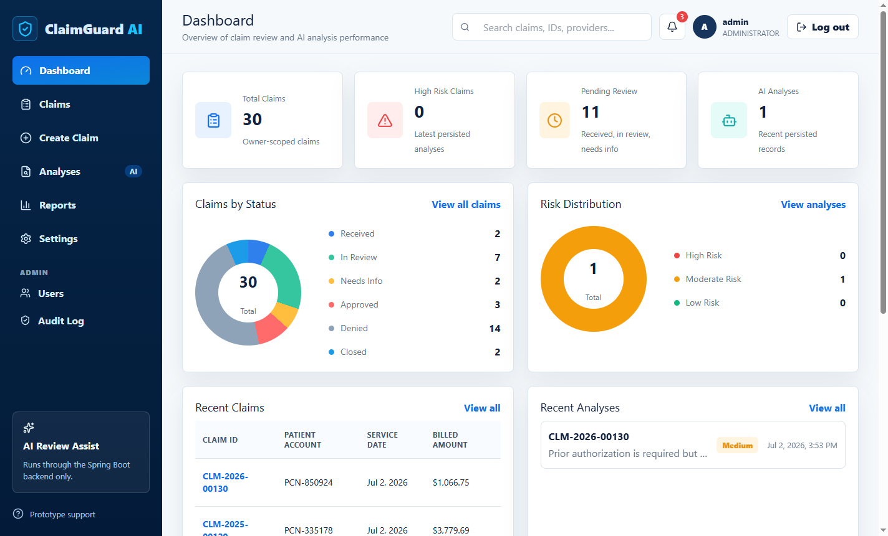
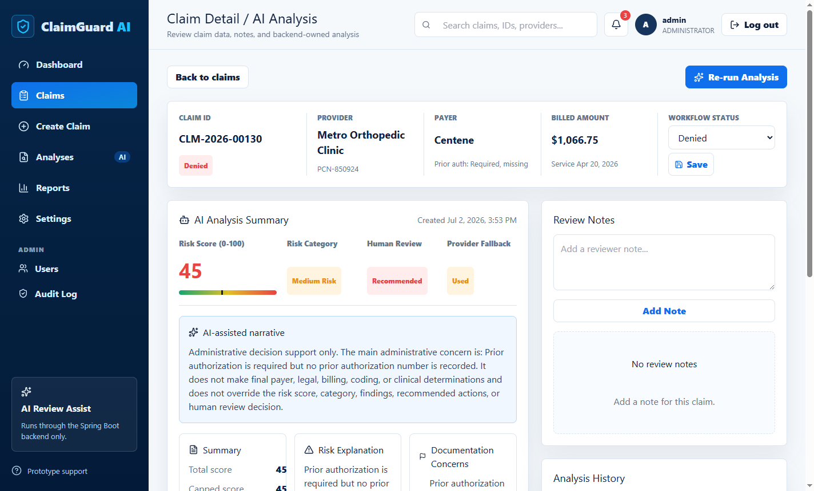
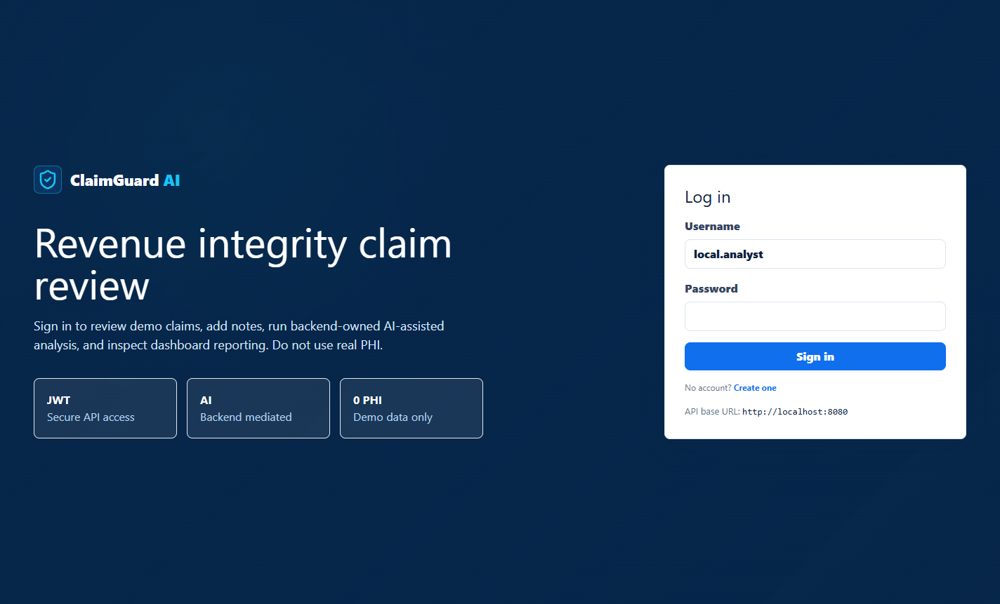
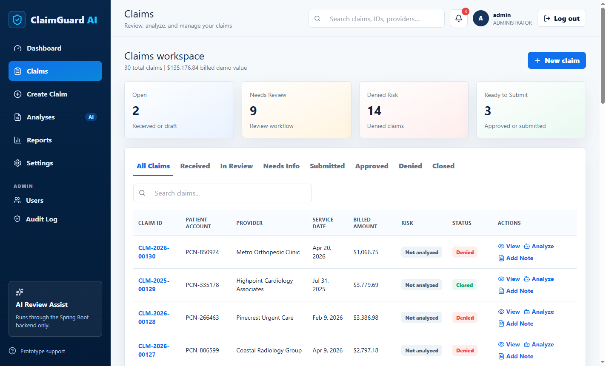
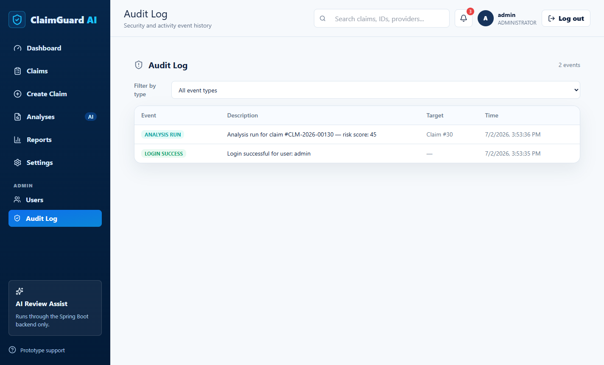
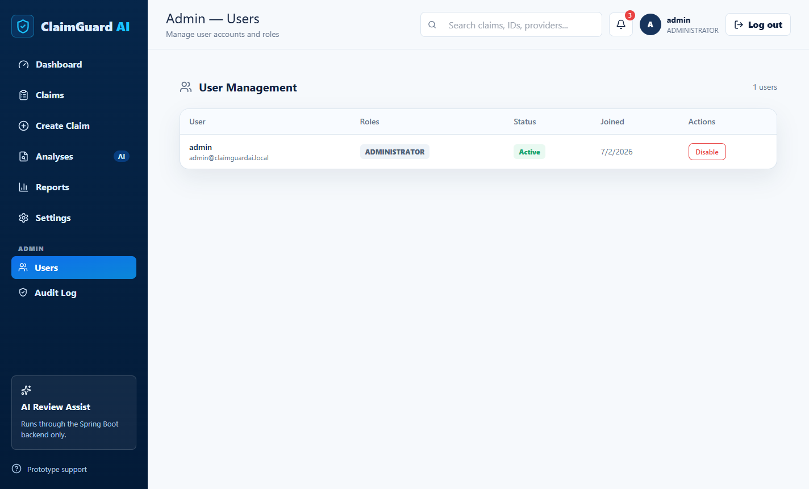
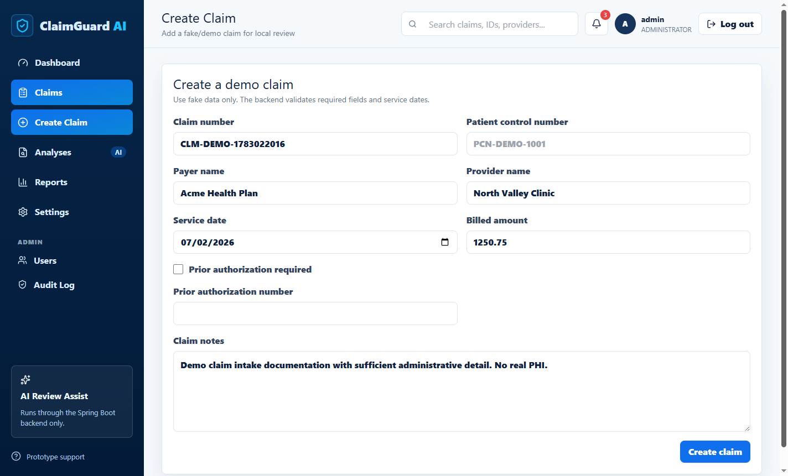
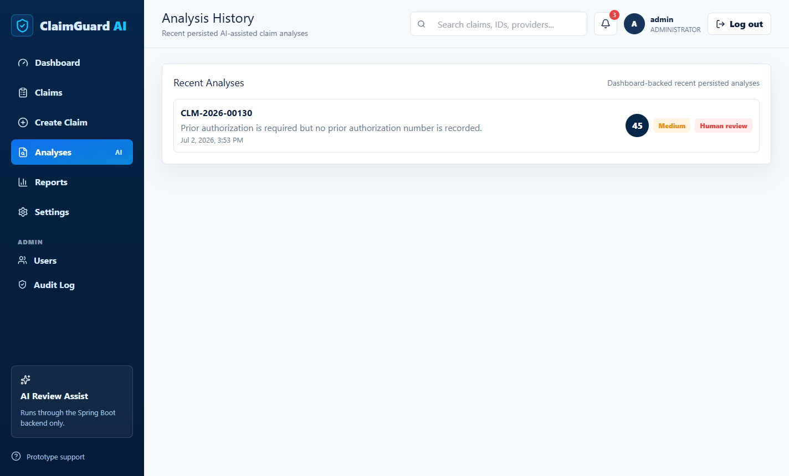
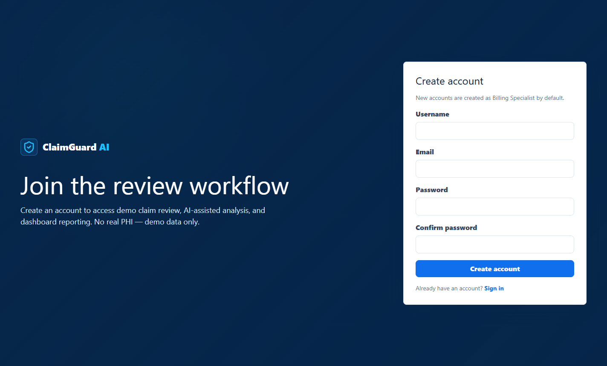
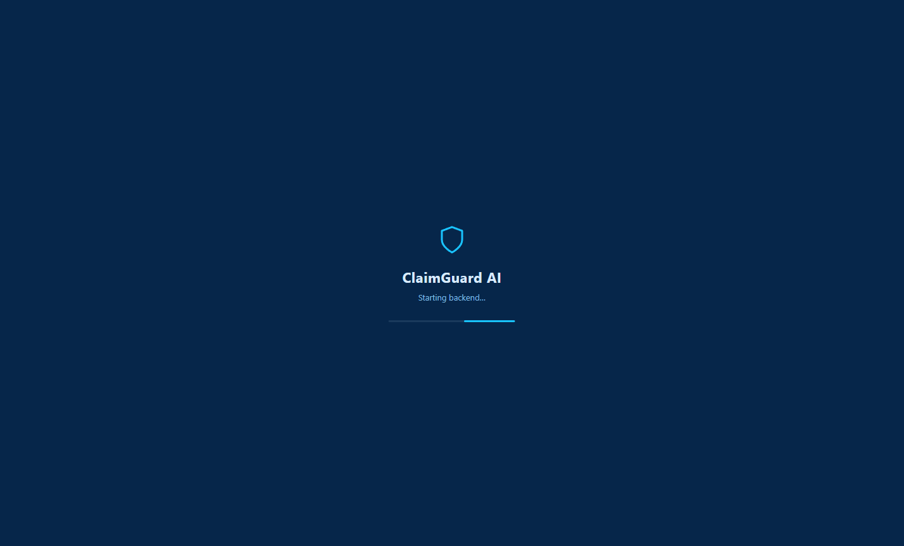

# ClaimGuard AI

ClaimGuard AI is a full-stack healthcare revenue cycle portfolio project for reviewing claim quality before submission. It demonstrates a production-style Spring Boot API and a React/TypeScript frontend — with authenticated claim intake, role-based access control, review workflow endpoints, deterministic risk scoring, AI-assisted analysis narratives, audit logging, admin user management, and a packaged Windows desktop app — without pretending to be a real payer, EHR, clearinghouse, or PHI-integrated platform.

## Screenshots

### Dashboard


### Claim detail with AI-assisted analysis


| Login | Claims workspace |
|---|---|
|  |  |

| Audit log | Admin user management |
|---|---|
|  |  |

| Create claim | Analysis history |
|---|---|
|  |  |

| Registration | Desktop splash screen |
|---|---|
|  |  |

## Why it exists

Manual claim review is repetitive, inconsistent, and hard to audit. This project shows how a backend can:

- capture claims in a structured way
- enforce authenticated, owner-scoped, role-based access
- record review workflow activity with a persistent audit trail
- surface deterministic administrative risk signals
- provide a clear demoable API and UI for technical review

The result is a portfolio-grade project that is easy to inspect on GitHub, easy to run locally, and straightforward to walk through in an interview or classroom setting.

## Current status

- Current version: `v1.2.0`
- All planned phases complete: backend, frontend, security hardening, AI integration, RBAC, audit logging, admin tooling, and desktop packaging
- The `frontend/` directory contains the full React/TypeScript + Tailwind CSS application
- The app can be packaged as a standalone Windows desktop application via Electron with the Spring Boot backend bundled

## What is implemented

- JWT authentication with rotating refresh tokens and server-side logout revocation
- self-service user registration with immediate token issuance
- role-based access control with five revenue cycle roles (`BILLING_SPECIALIST`, `REVENUE_CYCLE_ANALYST`, `CODING_REVIEWER`, `REVENUE_CYCLE_MANAGER`, `ADMINISTRATOR`)
- current-user endpoint for authenticated identity checks
- claim creation, listing, and detail retrieval
- owner-scoped claim status updates
- owner-scoped review note creation and retrieval
- deterministic claim analysis with persisted history
- optional OpenAI-backed claim review narrative generation with safe fallback
- structured risk scoring breakdowns and recommended actions
- owner-scoped dashboard summary metrics
- per-IP rate limiting on authentication endpoints (Bucket4j, 10 requests/minute)
- asynchronous audit logging for auth, claim, and analysis events with an admin-only audit API
- admin endpoints and UI for user management (role updates, enable/disable)
- demo claim seeding: every new account starts with 30 realistic claims weighted toward high-risk statuses
- health endpoint, structured errors, and correlation IDs
- local H2 support, PostgreSQL-oriented production profile, Flyway migrations, and container build support
- Electron desktop packaging with bundled backend JAR, file-based H2 persistence, custom app icon, and splash screen
- Render (backend) and Cloudflare Pages (frontend) deployment configuration

## What is not implemented

- no OCR, uploads, email, payments, payer connectivity, EHR connectivity, or clearinghouse connectivity
- no production-ready PHI workflow or HIPAA compliance claim
- no cross-tenant reporting

## Stack

Backend:

- Java 21
- Spring Boot 3.3
- Spring Web, Validation, Data JPA, Security
- Flyway
- Bucket4j for rate limiting
- PostgreSQL for production-style configuration
- H2 for local, test, and desktop profiles
- Maven

Frontend:

- React 19
- TypeScript
- Vite
- Tailwind CSS
- React Router
- Electron for desktop packaging

## Security model

- deny-by-default security posture for protected API routes
- Bearer JWT authentication for all protected endpoints
- rotating UUID refresh tokens stored server-side, revoked on logout
- method-level role authorization (`@PreAuthorize`) on admin and audit endpoints
- owner scoping for claims, review notes, analyses, and dashboard summaries
- per-IP rate limiting on login and registration (429 with `Retry-After`)
- asynchronous audit trail for logins, logouts, registrations, claim changes, and analysis runs
- structured `401`, `403`, `404`, `400`, and `429` responses
- correlation ID propagation through request handling and errors via `X-Correlation-Id`
- hardened response headers and environment-based CORS configuration
- production profile startup validation for JWT secret strength and explicit CORS origins
- AI provider configuration validation when AI is enabled
- local seeded user disabled by default in `prod`

This is a production-style security baseline for a portfolio project. It is not presented as certified HIPAA compliance, production PHI handling, or a real healthcare system integration.

## API summary

Public endpoints:

- `GET /api/health`
- `POST /api/auth/login`
- `POST /api/auth/register`
- `POST /api/auth/refresh`

Protected endpoints:

- `GET /api/auth/me`
- `POST /api/auth/logout`
- `POST /api/claims`
- `GET /api/claims`
- `GET /api/claims/{claimId}`
- `PATCH /api/claims/{claimId}/status`
- `POST /api/claims/{claimId}/review-notes`
- `GET /api/claims/{claimId}/review-notes`
- `POST /api/claims/{claimId}/analyze`
- `GET /api/claims/{claimId}/analysis/latest`
- `GET /api/claims/{claimId}/analysis/history`
- `GET /api/dashboard/summary`
- `GET /api/audit/events/me`

Administrator-only endpoints:

- `GET /api/audit/events`
- `GET /api/admin/users`
- `GET /api/admin/users/{userId}`
- `PATCH /api/admin/users/{userId}/roles`
- `PATCH /api/admin/users/{userId}/enabled`

Detailed request and response examples live in [docs/api/README.md](docs/api/README.md).

## Repository layout

- `backend/` Spring Boot API
- `frontend/` React/TypeScript application and Electron desktop shell
- `docs/` supporting project documentation and demo screenshots
- `database/` database reference folders
- `scripts/` helper scripts
- `render.yaml` Render deployment definition for the backend

## Local run

Prerequisites:

- Java 21
- Maven 3.9+
- Node.js and npm for the frontend

From [`backend/`](backend/):

```bash
mvn spring-boot:run -Dspring-boot.run.profiles=local
```

The default local profile uses in-memory H2 and seeds one demo user:

- username: `local.analyst`
- password: `LocalPass123!`

The API starts on `http://localhost:8080` by default.

From [`frontend/`](frontend/):

```bash
npm install
npm run dev
```

The frontend starts on `http://localhost:5173` and expects:

```bash
VITE_API_BASE_URL=http://localhost:8080
```

New accounts created through the registration page automatically start with 30 seeded demo claims weighted toward denied and needs-info statuses, so the dashboard and review workflow are immediately demoable.

## Desktop app

The frontend can be packaged as a standalone Windows desktop application that bundles the Spring Boot backend:

- Electron main process spawns the backend JAR on startup and waits for the health endpoint
- data persists in a file-based H2 database under the user's app-data directory
- the desktop profile seeds an `ADMINISTRATOR` account on first launch
- custom app icon, splash screen, clipboard/context-menu support, and remembered username

From [`frontend/`](frontend/):

```bash
npm run build          # build the React app
npx tsc -p tsconfig.electron.json   # compile the Electron main process
npm run assemble       # assemble the desktop app with the backend JAR
```

## Tests

From [`backend/`](backend/):

```bash
mvn test
```

The current suite covers:

- authentication, registration, refresh, and logout
- claim intake and owner scoping
- claim lifecycle review endpoints
- claim analysis and persisted history
- AI provider success, failure fallback, and configuration validation
- dashboard summary behavior
- health endpoint and hardened headers
- production configuration validation
- deterministic risk scoring

## Required environment variables

Local defaults exist, but these are the important runtime variables:

For `local`:

- `JWT_SECRET` optional because a local default exists
- `SERVER_PORT` optional, default `8080`
- `AI_ENABLED` optional, default `false`
- `AI_PROVIDER` optional, default `OPENAI`
- `AI_API_KEY` required only when `AI_ENABLED=true`
- `AI_MODEL` optional, default `gpt-4o-mini`
- `AI_TIMEOUT_SECONDS` optional, default `30`
- `REFRESH_TOKEN_EXPIRY_SECONDS` optional, default `604800` (7 days)

For `prod`:

- `SPRING_PROFILES_ACTIVE=prod`
- `JWT_SECRET` required and must be at least 32 characters
- `SPRING_DATASOURCE_URL`
- `SPRING_DATASOURCE_USERNAME`
- `SPRING_DATASOURCE_PASSWORD`

Optional:

- `CORS_ALLOWED_ORIGINS` comma-separated explicit origins
- `JWT_EXPIRATION_MINUTES`
- `CLAIMGUARDAI_RUNTIME_ENV`

More setup detail is in [docs/setup/LOCAL_SETUP.md](docs/setup/LOCAL_SETUP.md) and [docs/deployment/README.md](docs/deployment/README.md).

## Demo flow

The cleanest recruiter-friendly walkthrough is:

1. start the backend with the `local` profile
2. start the frontend with `npm run dev`
3. open `http://localhost:5173`
4. register a new account — it starts with 30 seeded demo claims
5. view the dashboard summary and risk distribution
6. list claims and fetch claim details
7. update status, add notes, and run claim analysis
8. view latest analysis and analysis history
9. as an administrator: review the audit log and manage users
10. show logout and protected route behavior

Use [docs/demo/DEMO_FLOW.md](docs/demo/DEMO_FLOW.md) for the exact commands.

## Portfolio / recruiter summary

ClaimGuard AI is best reviewed as a full-stack engineering project with a backend-first design. The strongest signals are:

- clean Spring Boot module organization
- authenticated, owner-scoped, and role-authorized REST endpoints
- rotating refresh token implementation with server-side revocation
- deterministic scoring logic with test coverage
- optional real OpenAI provider integration with explicit fallback behavior
- asynchronous audit logging that never blocks request handling
- structured error handling and request correlation
- production-style profile validation and deployment posture
- a packaged desktop distribution demonstrating end-to-end delivery
- honest boundaries around what is simulated versus truly integrated
- explicit non-claims around HIPAA, PHI readiness, payer connectivity, and clinical/legal decision making

## Roadmap / phase history

- `v0.1.0`: repository and documentation foundation
- `v0.2.0`: backend foundation
- `v0.3.0`: authentication and user foundation
- `v0.4.0`: claim intake foundation
- `v0.5.0`: claim lifecycle and review foundation
- `v0.6.0`: claim analysis foundation
- `v0.7.0`: deterministic risk scoring foundation
- `v0.8.0`: dashboard summary foundation
- `v0.9.0`: production readiness, security hardening, and deployment
- `v1.0.0 release candidate`: final polish, demo flow, release docs, and portfolio readiness
- `v1.1.0`: real OpenAI provider integration with deterministic scoring retained as source of truth
- `v1.2.0`: Tailwind CSS frontend, RBAC, registration, refresh tokens, rate limiting, audit logging, admin tooling, demo claim seeding, Electron desktop app, and cloud deployment configuration

Release notes: [docs/releases/v1.2.0.md](docs/releases/v1.2.0.md)
